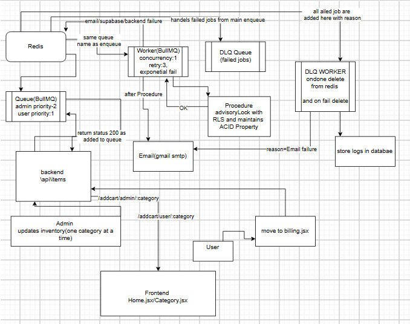

# 🛒 Distributed Cart & Order Processing System  
A fault-tolerant, queue-driven inventory and order management system using **Node.js, Redis, BullMQ, PostgreSQL (Supabase)** with ACID-safe stored procedures and DLQ handling.

---

## 📌 Overview

This project implements a **robust distributed system** for handling:

- Inventory updates  
- Admin item management  
- User cart operations  
- Automatic retries with exponential backoff  
- Dead Letter Queue (DLQ) processing  
- Email workflow notifications  

The system ensures **atomicity**, **idempotency**, and **failure recovery** using:

- Redis (job queues)
- BullMQ workers
- PostgreSQL advisory locks
- Stored procedures with ACID guarantees
- Gmail SMTP email notifications
- Dedicated DLQ worker for failed jobs

---

## 🧩 Architecture (Completed Modules)

### ✔ 1. Unified Queue (BullMQ)
- Single queue name for all worker types  
- Priority levels:  
  - **Admin = 2**  
  - **User = 1**

### ✔ 2. Worker (Concurrency: 1)
- Retries: **3**  
- Strategy: **Exponential backoff**  
- Handles inventory updates, user cart updates, and email events

### ✔ 3. PostgreSQL Procedure (ACID + RLS + Advisory Locks)
- Prevents race conditions  
- Ensures single-writer atomic updates  
- Fully transactional

### ✔ 4. Email Notifications (Gmail SMTP)
- Admin stock notifications  
- User order confirmations  
- Error alerts for failed jobs

### ✔ 5. DLQ (Dead Letter Queue)
- Collects all failed jobs  
- DLQ Worker:
  - Deletes completed jobs  
  - Logs failure reasons into the database  
  - Handles email/backend failures gracefully

### ✔ 6. Frontend Integration (React + Zustand)
Completed screens:  
- `Home.jsx`  
- `Category.jsx`  
- Item listing  
- Add-to-cart (synchronous mode)  
- Billing page navigation  

---

## 🔧 Tech Stack

| Layer | Technologies |
|-------|--------------|
| Backend | Node.js, Express.js, Redis, BullMQ |
| Database | PostgreSQL (Supabase), RLS, Stored Procedures |
| Frontend | React.js, Zustand |
| Email | Gmail SMTP + Nodemailer |
| Queueing | BullMQ Worker + DLQ Worker |

---

## 🚀 Current Status

### ✔ Completed
- Redis queue infrastructure  
- Worker with exponential retries  
- ACID-safe inventory updates using advisory locks  
- DLQ and DLQ Worker  
- Gmail email workflow  
- Admin inventory update  
- Add-to-cart API (**single immediate update**)  
- Failure logging system  
- Frontend integration for cart + categories  

### ❌ Not Completed Yet
### ⏳ **Async Batched Cart Update Worker**
- Batch size: 5 user jobs  
- Interval: every 2 minutes  
- Goal: reduce DB writes by ~70%  
- Frontend state updater pending  

---

## 📌 Future Work / Roadmap

### 🔄 1. Complete Async Cart Batch Worker
- Backend worker  with Debounce Logic and batch processing
- Zustand async state reconciliation  

### 🛍️ 2. Order Placement Pipeline
- Payment webhook handling  
- Final stock deduction  
- Email invoice flow  
-Email handling with cron workker

---
## 🖼️ System Architecture

